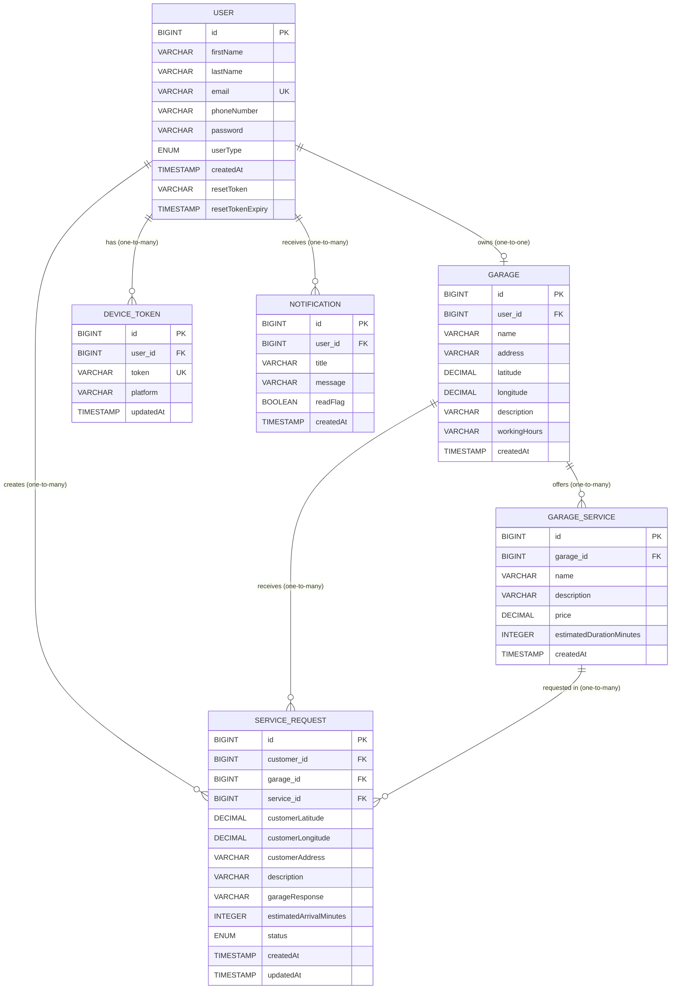
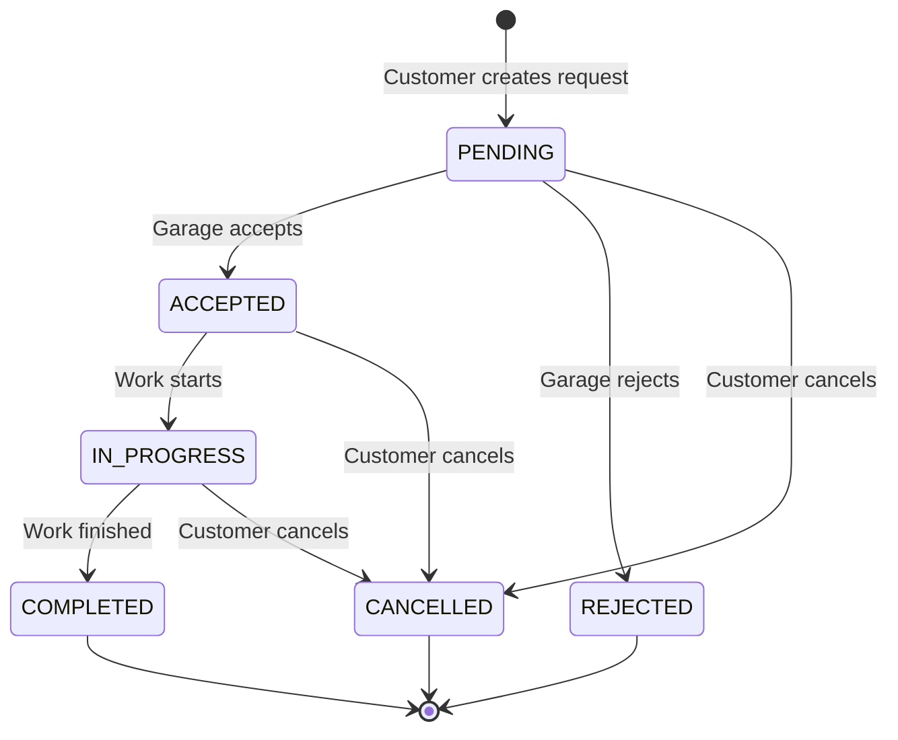

# Database Model Documentation

## Overview

The Garage Service Platform uses a relational database model designed to connect customers with nearby garage services. The database schema consists of **6 main entities** that work together to manage users, garages, services, service requests, device tokens, and notifications.

This document provides a comprehensive explanation of each table, their relationships, fields, constraints, and usage within the platform.

---

## Entity Relationship Diagram



---

## Table Descriptions

### 1. USER Table (`users`)

**Purpose**: Stores information about all users in the system, including both customers and garage owners.

#### Fields

| Field Name | Data Type | Constraints | Description |
|------------|-----------|-------------|-------------|
| `id` | BIGINT | PRIMARY KEY, AUTO_INCREMENT | Unique identifier for each user |
| `firstName` | VARCHAR(50) | NOT NULL | User's first name |
| `lastName` | VARCHAR(50) | NOT NULL | User's last name |
| `email` | VARCHAR(50) | NOT NULL, UNIQUE, EMAIL FORMAT | User's email address (used for login) |
| `phoneNumber` | VARCHAR(15) | NOT NULL | User's contact phone number |
| `password` | VARCHAR(120) | NOT NULL | Encrypted password (BCrypt hashed) |
| `userType` | ENUM | NOT NULL | User role: `CUSTOMER` or `GARAGE_OWNER` |
| `createdAt` | TIMESTAMP | NOT NULL, DEFAULT NOW | Account creation timestamp |
| `resetToken` | VARCHAR | NULLABLE | Token for password reset functionality |
| `resetTokenExpiry` | TIMESTAMP | NULLABLE | Expiration time for reset token |

#### Relationships

- **One-to-One** with `GARAGE`: A garage owner can have exactly one garage
- **One-to-Many** with `SERVICE_REQUEST`: A customer can create multiple service requests
- **One-to-Many** with `DEVICE_TOKEN`: A user can have multiple device tokens for push notifications
- **One-to-Many** with `NOTIFICATION`: A user can receive multiple notifications

#### User Types

- **CUSTOMER**: Regular users who search for garages and request services
- **GARAGE_OWNER**: Business users who manage garage profiles and services

#### Example Usage

```sql
-- Customer User
INSERT INTO users (firstName, lastName, email, phoneNumber, password, userType, createdAt)
VALUES ('John', 'Doe', 'john.doe@example.com', '+1234567890', '$2a$10$...', 'CUSTOMER', NOW());

-- Garage Owner User
INSERT INTO users (firstName, lastName, email, phoneNumber, password, userType, createdAt)
VALUES ('Jane', 'Smith', 'jane.smith@garage.com', '+0987654321', '$2a$10$...', 'GARAGE_OWNER', NOW());
```

---

### 2. GARAGE Table (`garages`)

**Purpose**: Stores garage business information including location, contact details, and operational information.

#### Fields

| Field Name | Data Type | Constraints | Description |
|------------|-----------|-------------|-------------|
| `id` | BIGINT | PRIMARY KEY, AUTO_INCREMENT | Unique identifier for each garage |
| `user_id` | BIGINT | FOREIGN KEY, UNIQUE | References the garage owner's user account |
| `name` | VARCHAR | NOT NULL | Business/garage name |
| `address` | VARCHAR | NOT NULL | Physical address of the garage |
| `latitude` | DECIMAL | NOT NULL, MIN: -90.0, MAX: 90.0 | GPS latitude coordinate |
| `longitude` | DECIMAL | NOT NULL, MIN: -180.0, MAX: 180.0 | GPS longitude coordinate |
| `description` | VARCHAR | NULLABLE | Detailed description of the garage and specialties |
| `workingHours` | VARCHAR | NULLABLE | Operating hours (e.g., "Mon-Fri: 8AM-6PM") |
| `createdAt` | TIMESTAMP | NOT NULL, DEFAULT NOW | Garage registration timestamp |

#### Relationships

- **One-to-One** with `USER`: Each garage belongs to exactly one garage owner
- **One-to-Many** with `GARAGE_SERVICE`: A garage can offer multiple services
- **One-to-Many** with `SERVICE_REQUEST`: A garage can receive multiple service requests

#### Key Features

- **Location-based searching**: Uses `latitude` and `longitude` for finding nearby garages
- **Validation**: GPS coordinates are validated to ensure they fall within valid ranges
- **One garage per owner**: The `user_id` foreign key ensures one garage owner can only have one garage

#### Example Usage

```sql
-- Create a garage
INSERT INTO garages (user_id, name, address, latitude, longitude, description, workingHours, createdAt)
VALUES (2, 'Quick Fix Auto Repair', '123 Main St, City, State', 40.7128, -74.0060, 
        'Full-service auto repair shop specializing in brakes and engine work', 
        'Monday-Friday: 8:00 AM - 6:00 PM, Saturday: 9:00 AM - 4:00 PM', NOW());
```

---

### 3. GARAGE_SERVICE Table (`garage_services`)

**Purpose**: Stores individual services offered by garages, including pricing and duration estimates.

#### Fields

| Field Name | Data Type | Constraints | Description |
|------------|-----------|-------------|-------------|
| `id` | BIGINT | PRIMARY KEY, AUTO_INCREMENT | Unique identifier for each service |
| `garage_id` | BIGINT | FOREIGN KEY, NOT NULL | References the garage offering this service |
| `name` | VARCHAR | NOT NULL | Service name (e.g., "Oil Change", "Brake Repair") |
| `description` | VARCHAR | NULLABLE | Detailed description of the service |
| `price` | DECIMAL | NOT NULL, MIN: 0.01 | Service price in decimal format |
| `estimatedDurationMinutes` | INTEGER | NULLABLE | Estimated time to complete service (in minutes) |
| `createdAt` | TIMESTAMP | NOT NULL, DEFAULT NOW | Service creation timestamp |

#### Relationships

- **Many-to-One** with `GARAGE`: Multiple services belong to one garage
- **One-to-Many** with `SERVICE_REQUEST`: A service can be requested multiple times

#### Price Handling

- Uses `BigDecimal` type for precise monetary calculations
- Minimum price validation ensures positive values only
- Stored in the base currency of the platform

#### Example Usage

```sql
-- Add services to a garage
INSERT INTO garage_services (garage_id, name, description, price, estimatedDurationMinutes, createdAt)
VALUES 
  (1, 'Oil Change', 'Full synthetic oil change with filter replacement', 49.99, 30, NOW()),
  (1, 'Brake Pad Replacement', 'Replace front and rear brake pads', 199.99, 120, NOW()),
  (1, 'Tire Rotation', 'Rotate all four tires and balance', 39.99, 45, NOW());
```

---

### 4. SERVICE_REQUEST Table (`service_requests`)

**Purpose**: Manages service requests created by customers and tracks their lifecycle from creation to completion.

#### Fields

| Field Name | Data Type | Constraints | Description |
|------------|-----------|-------------|-------------|
| `id` | BIGINT | PRIMARY KEY, AUTO_INCREMENT | Unique identifier for each request |
| `customer_id` | BIGINT | FOREIGN KEY, NOT NULL | References the customer who created the request |
| `garage_id` | BIGINT | FOREIGN KEY, NOT NULL | References the garage receiving the request |
| `service_id` | BIGINT | FOREIGN KEY, NOT NULL | References the specific service being requested |
| `customerLatitude` | DECIMAL | NOT NULL | Customer's GPS latitude at request time |
| `customerLongitude` | DECIMAL | NOT NULL | Customer's GPS longitude at request time |
| `customerAddress` | VARCHAR | NULLABLE | Customer's location address |
| `description` | VARCHAR | NULLABLE | Additional details from the customer |
| `garageResponse` | VARCHAR | NULLABLE | Response message from the garage |
| `estimatedArrivalMinutes` | INTEGER | NULLABLE | Estimated time for garage to arrive (if mobile service) |
| `status` | ENUM | NOT NULL, DEFAULT: PENDING | Current status of the request |
| `createdAt` | TIMESTAMP | NOT NULL, DEFAULT NOW | Request creation timestamp |
| `updatedAt` | TIMESTAMP | NOT NULL, DEFAULT NOW | Last update timestamp |

#### Request Status Flow

The `status` field follows this lifecycle:

1. **PENDING**: Initial state when request is created
2. **ACCEPTED**: Garage has accepted the request
3. **REJECTED**: Garage has declined the request
4. **IN_PROGRESS**: Service work has started
5. **COMPLETED**: Service work is finished
6. **CANCELLED**: Customer cancelled the request



#### Relationships

- **Many-to-One** with `USER` (customer): Multiple requests can be created by one customer
- **Many-to-One** with `GARAGE`: Multiple requests can be sent to one garage
- **Many-to-One** with `GARAGE_SERVICE`: Multiple requests can reference the same service

#### Key Features

- **Location tracking**: Stores customer's GPS coordinates for routing and distance calculations
- **Status updates**: `updatedAt` automatically updates when status changes
- **Communication**: Allows bidirectional messaging through `description` and `garageResponse`

#### Example Usage

```sql
-- Customer creates a service request
INSERT INTO service_requests 
(customer_id, garage_id, service_id, customerLatitude, customerLongitude, 
 customerAddress, description, status, createdAt, updatedAt)
VALUES 
(1, 1, 1, 40.7589, -73.9851, '456 Park Ave, City, State', 
 'Car won\'t start, need oil change', 'PENDING', NOW(), NOW());

-- Garage accepts and responds
UPDATE service_requests 
SET status = 'ACCEPTED', 
    garageResponse = 'We can help! Will arrive in 30 minutes', 
    estimatedArrivalMinutes = 30,
    updatedAt = NOW()
WHERE id = 1;
```

---

### 5. DEVICE_TOKEN Table (`device_tokens`)

**Purpose**: Stores Firebase Cloud Messaging (FCM) device tokens for push notification delivery.

#### Fields

| Field Name | Data Type | Constraints | Description |
|------------|-----------|-------------|-------------|
| `id` | BIGINT | PRIMARY KEY, AUTO_INCREMENT | Unique identifier for each token |
| `user_id` | BIGINT | FOREIGN KEY, NOT NULL, INDEXED | References the user who owns this device |
| `token` | VARCHAR(255) | NOT NULL, UNIQUE, INDEXED | FCM device token string |
| `platform` | VARCHAR(64) | NULLABLE | Platform identifier (e.g., "android", "ios", "web") |
| `updatedAt` | TIMESTAMP | NOT NULL, AUTO-UPDATE | Last time token was updated/verified |

#### Indexes

- **idx_device_token_user**: Index on `user_id` for fast lookups by user
- **idx_device_token_token**: Unique index on `token` to prevent duplicates

#### Relationships

- **Many-to-One** with `USER`: A user can have multiple device tokens (phone, tablet, web)

#### Key Features

- **Token uniqueness**: Each device token is unique across the system
- **Multi-device support**: Users can receive notifications on multiple devices
- **Auto-update**: `@PrePersist` and `@PreUpdate` annotations automatically update timestamp
- **Platform tracking**: Helps identify which platform to send notifications to

#### Example Usage

```sql
-- Register a device token for a user
INSERT INTO device_tokens (user_id, token, platform, updatedAt)
VALUES 
(1, 'dX7K9mN2pQ5rT8vW3yA6bC1eF4gH0jL9mP2sU5xZ8', 'android', NOW());

-- User logs in on a different device
INSERT INTO device_tokens (user_id, token, platform, updatedAt)
VALUES 
(1, 'aB2cD4eF6gH8iJ0kL1mN3oP5qR7sT9uV1wX3yZ5', 'ios', NOW());
```

---

### 6. NOTIFICATION Table (`notifications`)

**Purpose**: Stores notification history for users, allowing them to view past notifications and mark them as read.

#### Fields

| Field Name | Data Type | Constraints | Description |
|------------|-----------|-------------|-------------|
| `id` | BIGINT | PRIMARY KEY, AUTO_INCREMENT | Unique identifier for each notification |
| `user_id` | BIGINT | FOREIGN KEY, NOT NULL | References the user receiving the notification |
| `title` | VARCHAR(200) | NOT NULL | Notification title/subject |
| `message` | VARCHAR(1000) | NOT NULL | Notification body/content |
| `readFlag` | BOOLEAN | NOT NULL, DEFAULT: false | Whether user has read the notification |
| `createdAt` | TIMESTAMP | NOT NULL, DEFAULT NOW | Notification creation timestamp |

#### Relationships

- **Many-to-One** with `USER`: Multiple notifications can be sent to one user

#### Key Features

- **Read tracking**: `readFlag` allows tracking which notifications have been viewed
- **Message history**: Persistent storage of all notifications for user reference
- **Character limits**: Title (200 chars) and message (1000 chars) ensure reasonable sizes

#### Notification Types

Typical notification scenarios in the platform:

1. **Service Request Updates**: When a garage responds to a customer's request
2. **Status Changes**: When request status changes (accepted, in-progress, completed)
3. **New Requests**: When a garage receives a new service request
4. **System Notifications**: General platform updates or announcements

#### Example Usage

```sql
-- Notify customer that garage accepted their request
INSERT INTO notifications (user_id, title, message, readFlag, createdAt)
VALUES 
(1, 'Service Request Accepted', 
 'Quick Fix Auto Repair has accepted your oil change request. Estimated arrival: 30 minutes.', 
 false, NOW());

-- Notify garage of new service request
INSERT INTO notifications (user_id, title, message, readFlag, createdAt)
VALUES 
(2, 'New Service Request', 
 'John Doe has requested an oil change service at 456 Park Ave.', 
 false, NOW());

-- Mark notification as read
UPDATE notifications SET readFlag = true WHERE id = 1;
```

---

## Database Relationships Summary

### One-to-One Relationships

| Parent Table | Child Table | Description |
|--------------|-------------|-------------|
| USER (garage_owner) | GARAGE | A garage owner can have exactly one garage |

### One-to-Many Relationships

| Parent Table | Child Table | Description |
|--------------|-------------|-------------|
| USER (customer) | SERVICE_REQUEST | A customer can create multiple service requests |
| USER | DEVICE_TOKEN | A user can have multiple devices registered for notifications |
| USER | NOTIFICATION | A user can receive multiple notifications |
| GARAGE | GARAGE_SERVICE | A garage can offer multiple services |
| GARAGE | SERVICE_REQUEST | A garage can receive multiple service requests |
| GARAGE_SERVICE | SERVICE_REQUEST | A service can be requested multiple times |

---

## Data Integrity and Constraints

### Primary Keys

All tables use auto-incrementing `BIGINT` primary keys (`id`) for:
- Efficient indexing
- Scalability (supports billions of records)
- Simplicity in relationships

### Foreign Keys

Foreign key constraints ensure referential integrity:
- **CASCADE DELETE**: When a parent record is deleted, related child records are also deleted
- **LAZY FETCH**: Related entities are loaded only when accessed, improving performance

### Validation Constraints

#### User Table
- Email must be valid format and unique
- Phone number max 15 characters
- Password min/max constraints (handled by BCrypt)

#### Garage Table
- Latitude: Must be between -90.0 and 90.0
- Longitude: Must be between -180.0 and 180.0
- Name and address are required

#### GarageService Table
- Price must be greater than 0
- Name is required

#### ServiceRequest Table
- Customer location (lat/lng) is required
- Status must be a valid enum value

#### DeviceToken Table
- Token must be unique across the system
- User reference is required

#### Notification Table
- Title max 200 characters
- Message max 1000 characters
- User reference is required

---

## Common Query Patterns

### Find Nearby Garages

```sql
-- Using Haversine formula to calculate distance
SELECT g.*, 
       (6371 * acos(cos(radians(:userLat)) 
       * cos(radians(g.latitude)) 
       * cos(radians(g.longitude) - radians(:userLng)) 
       + sin(radians(:userLat)) 
       * sin(radians(g.latitude)))) AS distance
FROM garages g
HAVING distance < :radiusKm
ORDER BY distance ASC;
```

### Get Customer's Service Requests with Details

```sql
SELECT sr.*, 
       u.firstName AS customerFirstName,
       u.lastName AS customerLastName,
       g.name AS garageName,
       gs.name AS serviceName,
       gs.price AS servicePrice
FROM service_requests sr
JOIN users u ON sr.customer_id = u.id
JOIN garages g ON sr.garage_id = g.id
JOIN garage_services gs ON sr.service_id = gs.id
WHERE sr.customer_id = :customerId
ORDER BY sr.createdAt DESC;
```

### Get Garage's Pending Requests

```sql
SELECT sr.*,
       u.firstName AS customerFirstName,
       u.lastName AS customerLastName,
       u.phoneNumber AS customerPhone,
       gs.name AS serviceName
FROM service_requests sr
JOIN users u ON sr.customer_id = u.id
JOIN garage_services gs ON sr.service_id = gs.id
WHERE sr.garage_id = :garageId
  AND sr.status = 'PENDING'
ORDER BY sr.createdAt ASC;
```

### Get Unread Notifications for User

```sql
SELECT * FROM notifications
WHERE user_id = :userId
  AND readFlag = false
ORDER BY createdAt DESC;
```

---

## Indexing Strategy

### Recommended Indexes

```sql
-- User table indexes
CREATE INDEX idx_user_email ON users(email);
CREATE INDEX idx_user_type ON users(userType);

-- Garage table indexes
CREATE INDEX idx_garage_location ON garages(latitude, longitude);
CREATE INDEX idx_garage_user ON garages(user_id);

-- Service Request table indexes
CREATE INDEX idx_request_customer ON service_requests(customer_id);
CREATE INDEX idx_request_garage ON service_requests(garage_id);
CREATE INDEX idx_request_status ON service_requests(status);
CREATE INDEX idx_request_created ON service_requests(createdAt);

-- Notification table indexes
CREATE INDEX idx_notification_user ON notifications(user_id);
CREATE INDEX idx_notification_read ON notifications(readFlag);

-- Device Token indexes (already defined in entity)
-- idx_device_token_user on user_id
-- idx_device_token_token on token (UNIQUE)
```

---

## Database Configuration

### H2 (Development)

```properties
spring.datasource.url=jdbc:h2:mem:testdb
spring.datasource.username=sa
spring.datasource.password=password
spring.jpa.database-platform=org.hibernate.dialect.H2Dialect
spring.h2.console.enabled=true
```

### PostgreSQL (Production - Recommended)

```properties
spring.datasource.url=jdbc:postgresql://localhost:5432/garage_service
spring.datasource.username=postgres
spring.datasource.password=your_password
spring.jpa.database-platform=org.hibernate.dialect.PostgreSQLDialect
spring.jpa.hibernate.ddl-auto=update
```

### MySQL (Production - Alternative)

```properties
spring.datasource.url=jdbc:mysql://localhost:3306/garage_service
spring.datasource.username=root
spring.datasource.password=your_password
spring.jpa.database-platform=org.hibernate.dialect.MySQL8Dialect
spring.jpa.hibernate.ddl-auto=update
```

---

## Best Practices

### 1. Data Integrity
- Always use transactions for multi-table operations
- Validate data at both application and database levels
- Use foreign key constraints to maintain referential integrity

### 2. Performance
- Use lazy loading for relationships to avoid N+1 queries
- Index frequently queried fields
- Use pagination for large result sets
- Consider caching for read-heavy operations

### 3. Security
- Never store plain-text passwords (use BCrypt)
- Validate and sanitize all user inputs
- Use parameterized queries to prevent SQL injection
- Apply proper access controls based on user roles

### 4. Scalability
- Use connection pooling for database connections
- Consider read replicas for read-heavy workloads
- Archive old completed requests periodically
- Monitor and optimize slow queries

---

## Migration Considerations

### Adding New Fields

When adding new fields to existing tables:

```sql
-- Example: Add rating field to garage
ALTER TABLE garages ADD COLUMN rating DECIMAL(2,1) DEFAULT 0.0;
ALTER TABLE garages ADD COLUMN total_reviews INTEGER DEFAULT 0;
```

### Creating New Tables

For new features like reviews:

```sql
CREATE TABLE reviews (
    id BIGINT AUTO_INCREMENT PRIMARY KEY,
    customer_id BIGINT NOT NULL,
    garage_id BIGINT NOT NULL,
    service_request_id BIGINT,
    rating INTEGER NOT NULL CHECK (rating BETWEEN 1 AND 5),
    comment VARCHAR(500),
    created_at TIMESTAMP DEFAULT CURRENT_TIMESTAMP,
    FOREIGN KEY (customer_id) REFERENCES users(id),
    FOREIGN KEY (garage_id) REFERENCES garages(id),
    FOREIGN KEY (service_request_id) REFERENCES service_requests(id)
);
```

---

## Conclusion

This database model provides a solid foundation for the Garage Service Platform, supporting:

- **User Management**: Separate roles for customers and garage owners
- **Location Services**: GPS-based garage discovery
- **Service Management**: Flexible service catalog per garage
- **Request Tracking**: Complete lifecycle management of service requests
- **Real-time Notifications**: Push notification support via FCM
- **Notification History**: Persistent storage of all notifications

The schema is designed with scalability, data integrity, and performance in mind, following industry best practices for relational database design.

---

## Additional Resources

- **JPA/Hibernate Documentation**: [Hibernate ORM Documentation](https://hibernate.org/orm/documentation/)
- **Spring Data JPA**: [Spring Data JPA Reference](https://docs.spring.io/spring-data/jpa/docs/current/reference/html/)
- **Database Normalization**: [Database Normal Forms](https://en.wikipedia.org/wiki/Database_normalization)
- **SQL Performance**: [SQL Optimization Guide](https://use-the-index-luke.com/)

---

*Last Updated: 2025-10-15*  
*Database Version: 1.0*  
*Platform: Garage Service Platform*
